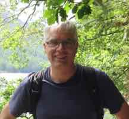

# Alex Simpson

I am professor of computer science at the Faculty of Mathematics and Physics, University of Ljubljana, Slovenia.  I also work at the Institute for Mathematics, Physics and Mechanics, Ljubljana. 
Before 2015, I was based at the Laboratory for Foundations of Computer Science, School of Informatics, University of Edinburgh, where from 2010 I held a personal chair in foundations of computer science.

I am interested in the foundations of mathematics and computer science and in interactions between them.

Contact: Alex dot Simpson at fmf dot uni dash lj dot si

This webpage is under construction.

# Talks

Selected recent talks.

- *A Tutorial on Sheaf Semantics*. Invited tutorial at LICS, July  2024. ([slides](Talks/TutorialOnSheafSemantics.pdf))
- *Three Toposes for  Probability and Randomness*. Topos Colloquium, June 2024. ([slides](Talks/ThreeToposes.pdf), [video](https://www.youtube.com/watch?v=Y1RkPhwJ0Mo))
- *Probabilistic Programming with Coinductive Data*. Invited talk at MFPS 2023. ([slides](Talks/SimpsonMFPS2023.pdf))
- *A Mathematical Theory of True Randomness*. Two-part seminar given at UNISA in Pretoria, January 2023.  ([slides](Talks/Pretoria23.pdf), [video](https://www.youtube.com/watch?v=NEqHOtl3-I0))
- *Synthetic Probability Theory*. Categorical Probability and Statistics 2020. ([slides](Talks/synthProbThry.pdf), [video](https://www.youtube.com/watch?v=XtsBsLM9ofk))

# Papers

Selected recent papers.

- *An Imperative Language for Verified Exact Real-Number Computation*, with Andrej Bauer and Sewon Park. ([ArXiV preprint](https://arxiv.org/abs/2409.11946))

- *Equivalence and Conditional Independence in Atomic Sheaf Logic*. LICS 2024. ([ACM publication](https://dl.acm.org/doi/10.1145/3661814.3662132), [LICS slides](Talks/lics2024Simpson.pdf), [ArXiV preprint](https://arxiv.org/abs/2405.11073))

- *Category-theoretic Structure for Independence and Conditional Independence*. MFPS 2017. ([ENTCS publication](https://doi.org/10.1016/j.entcs.2018.03.028), [preprint](Papers/conditional-independence.pdf))

# Teaching

Selected lecture courses

- *Category Theory*. Mathematics PhD course, 2022-23. ([Lecture videos](https://www.youtube.com/playlist?list=PLx3dTuDvniVLVjpE8z4wptprGGwuDuzLp))

- *Computability Theory*. Mathematics MSc course, 2022-23. ([Lecture notes](Teaching/tinotes.pdf))

